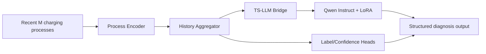

# ChargeLLM

ChargeLLM is a TS-LLM project for battery diagnosis from multiple charging histories. It combines time-series encoding, structured diagnosis generation, supervised fine-tuning, and GRPO-based alignment in one codebase.

## Goal

The model consumes the recent charging history of one battery and produces a structured diagnosis object containing:

- `label`
- `confidence`
- `key_processes`
- `explanation`

Current implementation path:

1. encode multiple charging processes with a time-series backbone
2. aggregate them into a battery-level history representation
3. map that representation into the LLM hidden space through a bridge
4. generate structured JSON with a Qwen Instruct model
5. run SFT first and GRPO second

## Core Architecture



Implementation-level details are documented in [docs/architecture.md](docs/architecture.md).

## Repository Layout

```text
src/chargellm/
  data/
  llm/
  models/
  rewards/
  schemas/
  training/
  inference/
docs/
dataset/
tests/
```

## Datasets

Base datasets:

- `dataset/sft.json`
- `dataset/grpo.json`
- `dataset/origin.jsonl`

Synthetic datasets:

- `dataset/synthetic_sft.json`
- `dataset/synthetic_grpo.json`
- `dataset/synthetic_origin.jsonl`

The synthetic data satisfies:

- 2 to 6 hours per charging process
- 1-minute sampling interval
- coherent current, voltage, power, and cumulative charge trajectories
- label-specific historical differences that remain physically plausible

## Model Configuration

The documentation does not hardcode machine-specific absolute paths. Pass the model path explicitly at runtime, for example:

```bash
python -m chargellm.training.train_sft --train --model-name-or-path models/Qwen3-0.6B
```

If the model weights live outside the repository, pass them through CLI arguments or environment variables.

## Quick Start

1. Create a virtual environment and install dependencies.

```bash
python -m venv .venv
source .venv/bin/activate
python -m pip install --upgrade pip
python -m pip install -r requirements.txt
python -m pip install -e .
```

2. Verify the model path and preview the SFT dataset.

```bash
python -m chargellm.training.train_sft --dataset-view --data-path dataset/sft.json --model-name-or-path models/Qwen3-0.6B
```

3. Run the tests to validate the schemas, collators, and restore path.

```bash
pytest
```

4. Optionally generate more realistic synthetic data for demos.

```bash
python scripts/generate_synthetic_data.py
```

5. Run a one-step SFT smoke training.

```bash
python -m chargellm.training.train_sft \
  --train \
  --data-path dataset/sft.json \
  --model-name-or-path models/Qwen3-0.6B \
  --output-dir artifacts/sft-smoke \
  --batch-size 1 \
  --epochs 1 \
  --max-steps 1
```

6. Run a one-step GRPO smoke training from the SFT checkpoint.

```bash
python -m chargellm.training.train_grpo \
  --train \
  --data-path dataset/grpo.json \
  --model-name-or-path models/Qwen3-0.6B \
  --checkpoint-dir artifacts/sft-smoke \
  --output-dir artifacts/grpo-smoke \
  --batch-size 1 \
  --epochs 1 \
  --max-steps 1
```

7. Run demo inference with the saved checkpoint.

```bash
python -m chargellm.inference.infer_demo \
  --data-path dataset/sft.json \
  --index 0 \
  --model-name-or-path models/Qwen3-0.6B \
  --checkpoint-dir artifacts/sft-smoke
```

## Common Commands

Preview SFT data:

```bash
python -m chargellm.training.train_sft --dataset-view --data-path dataset/sft.json
```

Run a one-step SFT smoke test:

```bash
python -m chargellm.training.train_sft --train --data-path dataset/sft.json --output-dir artifacts/sft-smoke --batch-size 1 --epochs 1 --max-steps 1
```

Run a one-step GRPO smoke test:

```bash
python -m chargellm.training.train_grpo --train --data-path dataset/grpo.json --checkpoint-dir artifacts/sft-smoke --output-dir artifacts/grpo-smoke --batch-size 1 --epochs 1 --max-steps 1
```

Generate synthetic datasets:

```bash
python scripts/generate_synthetic_data.py
```

## Repository Files

- `pyproject.toml`: project metadata and dependency source of truth
- `requirements.txt`: simple install entry point for local environments and CI
- `LICENSE`: repository license text
- `.gitignore`: ignore rules for virtual environments, artifacts, model weights, and local editor files

## Documentation

- Architecture: [docs/architecture.md](docs/architecture.md)
- Data contract: [docs/data_contract.md](docs/data_contract.md)
- SFT and GRPO plan: [docs/sft_grpo_plan.md](docs/sft_grpo_plan.md)
- Testing strategy: [docs/testing_strategy.md](docs/testing_strategy.md)