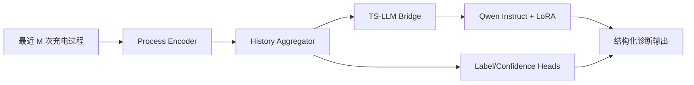

# ChargeLLM

ChargeLLM 是一个面向电池多次充电历史诊断的 TS-LLM 项目，目标是把时序建模、结构化诊断生成、监督微调和强化对齐统一到一套工程流程中。

## 项目目标

输入是一块电池最近多次完整充电过程，输出是结构化诊断对象，包括：

- `label`
- `confidence`
- `key_processes`
- `explanation`

当前工程实现路线：

1. 对多次充电过程进行时序编码
2. 聚合为电池级历史表示
3. 将历史表示通过 bridge 映射到 LLM 隐空间
4. 用 Qwen Instruct 模型生成结构化 JSON
5. 先执行 SFT，再执行 GRPO

## 核心架构



实现级说明见 [docs/architecture.md](docs/architecture.md)。

## 目录结构

```text
src/chargellm/
  data/
  llm/
  models/
  rewards/
  schemas/
  training/
  inference/
docs/
dataset/
tests/
```

## 数据文件

基础数据：

- `dataset/sft.json`
- `dataset/grpo.json`
- `dataset/origin.jsonl`

新增合成数据：

- `dataset/synthetic_sft.json`
- `dataset/synthetic_grpo.json`
- `dataset/synthetic_origin.jsonl`

这些合成数据满足以下约束：

- 单次充电时长 2 到 6 小时
- 采样间隔 1 分钟
- `current_series`、`voltage_series`、`power_series`、`charge_capacity` 趋势一致
- 标签级别存在可解释的形态差异

## 模型配置

README 不写机器相关绝对路径。运行时请通过参数传入模型目录，例如：

```bash
python -m chargellm.training.train_sft --train --model-name-or-path models/Qwen3-0.6B
```

如果模型在仓库外部，建议通过命令行参数或环境变量传入。

## Quick Start

1. 创建虚拟环境并安装依赖。

```bash
python -m venv .venv
source .venv/bin/activate
python -m pip install --upgrade pip
python -m pip install -r requirements.txt
python -m pip install -e .
```

2. 先确认模型目录可用，然后查看数据是否能被正确读取。

```bash
python -m chargellm.training.train_sft --dataset-view --data-path dataset/sft.json --model-name-or-path models/Qwen3-0.6B
```

3. 运行测试，确认基础契约和数据管线正常。

```bash
pytest
```

4. 如需补充演示数据，先生成一批合成样本。

```bash
python scripts/generate_synthetic_data.py
```

5. 执行单步 SFT 冒烟训练，验证训练、保存 checkpoint、LoRA 输出链路。

```bash
python -m chargellm.training.train_sft \
  --train \
  --data-path dataset/sft.json \
  --model-name-or-path models/Qwen3-0.6B \
  --output-dir artifacts/sft-smoke \
  --batch-size 1 \
  --epochs 1 \
  --max-steps 1
```

6. 基于 SFT checkpoint 执行单步 GRPO 冒烟训练。

```bash
python -m chargellm.training.train_grpo \
  --train \
  --data-path dataset/grpo.json \
  --model-name-or-path models/Qwen3-0.6B \
  --checkpoint-dir artifacts/sft-smoke \
  --output-dir artifacts/grpo-smoke \
  --batch-size 1 \
  --epochs 1 \
  --max-steps 1
```

7. 使用训练得到的 checkpoint 执行推理演示。

```bash
python -m chargellm.inference.infer_demo \
  --data-path dataset/sft.json \
  --index 0 \
  --model-name-or-path models/Qwen3-0.6B \
  --checkpoint-dir artifacts/sft-smoke
```

## 常用命令

预览 SFT 数据：

```bash
python -m chargellm.training.train_sft --dataset-view --data-path dataset/sft.json
```

执行单步 SFT 冒烟：

```bash
python -m chargellm.training.train_sft --train --data-path dataset/sft.json --output-dir artifacts/sft-smoke --batch-size 1 --epochs 1 --max-steps 1
```

执行单步 GRPO 冒烟：

```bash
python -m chargellm.training.train_grpo --train --data-path dataset/grpo.json --checkpoint-dir artifacts/sft-smoke --output-dir artifacts/grpo-smoke --batch-size 1 --epochs 1 --max-steps 1
```

生成合成数据：

```bash
python scripts/generate_synthetic_data.py
```

## 仓库基础文件

- `pyproject.toml`：项目元数据与依赖定义的主来源
- `requirements.txt`：本地环境与 CI 的简化安装入口
- `LICENSE`：仓库许可证文本
- `.gitignore`：忽略虚拟环境、训练产物、模型权重和本地编辑器文件

## 相关文档

- 架构说明: [docs/architecture.md](docs/architecture.md)
- 数据契约: [docs/data_contract.md](docs/data_contract.md)
- SFT / GRPO 方案: [docs/sft_grpo_plan.md](docs/sft_grpo_plan.md)
- 测试策略: [docs/testing_strategy.md](docs/testing_strategy.md)