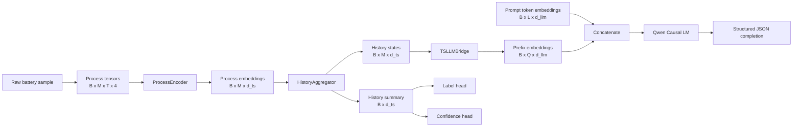
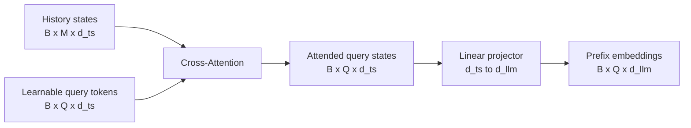

# Architecture

## Goal

Build an end-to-end TS-LLM diagnostic model for battery-level classification and explanation.

## Minimal First Milestone

The first milestone is a single runnable path:

1. Load battery charging histories.
2. Convert each charging process into multivariate tensors.
3. Encode processes with a temporal encoder.
4. Aggregate recent process history into history states.
5. Project history states into the LLM embedding space.
6. Generate a structured diagnosis object.
7. Train with SFT first and GRPO second.

## Model Blocks

### 1. Process Encoder

Input per process:

- current series
- voltage series
- power series
- charge capacity series

Output:

- process token states
- process summary embedding

Implementation note:

- the current encoder uses an input projection followed by lightweight feed-forward layers
- masked pooling over the time dimension yields one embedding per charging process

If the input tensor is:

$$
X \in \mathbb{R}^{B \times M \times T \times 4}
$$

then after the process encoder and masked pooling, the process representation becomes:

$$
H_p \in \mathbb{R}^{B \times M \times d_{ts}}
$$

### 2. History Aggregator

Input:

- recent `M` process embeddings

Output:

- history token states
- history summary embedding
- process importance scores

Implementation note:

- the current aggregator uses a learned scalar attention score per process
- attention weights are masked by valid process positions
- the weighted sum gives the battery-level summary vector

Formally:

$$
\alpha_i = \text{softmax}(W h_i)
$$

$$
h_{hist} = \sum_i \alpha_i h_i
$$

### 3. TS-LLM Bridge

Input:

- history token states

Output:

- prefix embeddings aligned to the LLM hidden size

The first implementation uses learnable query tokens plus cross-attention and a projector.

This is the key step that turns battery history into LLM-consumable sequence content.

The bridge contains:

1. learnable query tokens
2. multi-head cross-attention from queries to history states
3. a linear projector from `d_ts` to `d_llm`

If the number of query tokens is `Q`, then the bridge produces:

$$
P \in \mathbb{R}^{B \times Q \times d_{llm}}
$$

where `P` is used as a learned multimodal prefix.

### 4. Diagnostic LLM

Base model:

- local development path `/root/autodl-fs/models/Qwen3-0.6B`

Fine-tuning:

- LoRA on causal LM target modules
- custom projector and auxiliary heads saved in full

State management rule:

- PEFT manages LoRA adapter weights on the LLM side
- TS-side modules like `process_encoder`, `history_aggregator`, `bridge`, and auxiliary heads are saved from the wrapper state separately

Current integration path:

- use TS encoder output as learned prefix embeddings
- concatenate prefix embeddings with token embeddings through `inputs_embeds`
- train the LLM while masking prefix positions in language-model labels
- use tokenizer chat templates to separate prompt tokens from assistant completion tokens during SFT

The combined embedding sequence is:

$$
E_{all} = [P ; E_{text}] \in \mathbb{R}^{B \times (Q + L) \times d_{llm}}
$$

The combined attention mask is:

$$
M_{all} = [\mathbf{1}_Q ; M_{text}]
$$

The LM labels are masked over the prefix region:

$$
Y_{all} = [\underbrace{-100, \dots, -100}_{Q}, Y_{text}]
$$

This means the prefix influences generation but is not itself supervised as text.

### 5. Auxiliary Heads

First milestone keeps two heads:

- label head
- confidence head

These support stable supervision and structured decoding.

Current role in the implementation:

- `label_head` produces logits from the history summary vector
- `confidence_head` produces a scalar confidence estimate in `[0, 1]`
- only the label head participates in the current explicit supervised loss

## Training Stages

### Stage A: SFT

Data source:

- `dataset/sft.json`

Target:

- structured diagnosis JSON with explanation sourced from `reason`

Data adapter:

- local JSON samples are converted into conversational `prompt` and `completion` records compatible with TRL dataset conventions

Loss:

$$
\mathcal{L}_{sft} = \mathcal{L}_{lm} + \lambda_{cls}\mathcal{L}_{cls}
$$

where:

- $\mathcal{L}_{lm}$ is the causal LM loss on assistant completion tokens only
- $\mathcal{L}_{cls}$ is cross-entropy on the battery class predicted from the TS summary
- $\lambda_{cls}$ is controlled by `classification_loss_weight`

In code terms:

- prompt tokens are masked out of `lm_labels`
- prefix tokens are also masked out of `lm_labels`
- only assistant JSON tokens contribute to `\mathcal{L}_{lm}`

### Stage B: GRPO

Data source:

- `dataset/grpo.json`

Target:

- improve label correctness, output format, and confidence behavior

Data adapter:

- local JSON samples are converted into conversational prompt-only records with side-channel metadata for reward functions

Training path:

- restore the model from an SFT checkpoint
- sample multiple completions per battery history
- compute programmatic rewards over generated JSON strings
- normalize rewards within each group to obtain relative advantages
- optimize completion log-probabilities using those group-relative advantages

Current GRPO objective:

$$
r_i = r_{json} + r_{label} + r_{conf} + r_{proc}
$$

$$
A_i = \frac{r_i - \mu(r)}{\sigma(r) + \epsilon}
$$

$$
\mathcal{L}_{grpo} = - \frac{1}{N} \sum_i A_i \log \pi_\theta(y_i \mid x)
$$

The current reward terms are intentionally narrow and verifiable:

- valid JSON parse
- correct label field
- confidence in `[0, 1]`
- key process IDs drawn from the current battery sample

This is a deliberate first-stage reward design that prioritizes controllability over ambitious semantic judging.

## Checkpoint Structure

The project saves the model in two logical parts:

1. LLM adapter checkpoint
2. TS wrapper checkpoint

Artifacts:

- `llm_adapter/`: PEFT adapter weights
- `wrapper_state.pt`: TS encoder, history aggregator, bridge, label head, confidence head
- `trainer_state.pt`: optimizer state and step

This split is necessary because the time-series modules are not part of the base Hugging Face causal LM class.

## First-Milestone Non-Goals

- no mid-training tasks yet
- no full production deployment yet
- no unsupported mechanism-level chemical explanations